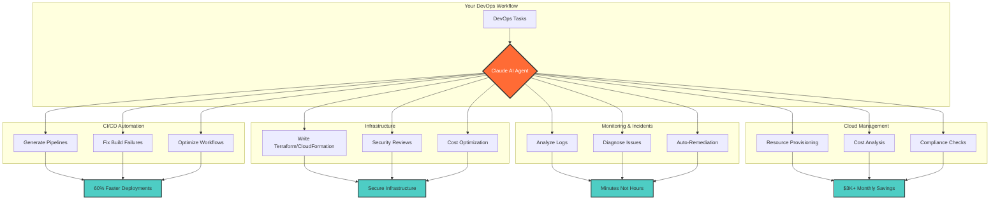

# Claude AI DevOps Agent - Diagram

## Mermaid Diagram (Convert to Image)



## How to Create the Image

### Option 1: Use Mermaid Live Editor (Recommended)
1. Go to: https://mermaid.live/
2. Copy the mermaid code above (between ```mermaid and ```)
3. Paste it in the editor
4. Click "Actions" → "PNG" or "SVG"
5. Download the image

### Option 2: Use GitHub to Render
1. Create a new file in your repo called `diagram.md`
2. Paste the mermaid code
3. GitHub will render it automatically
4. Take a screenshot

### Option 3: Use Canva (Most Professional)
I've created a design brief below for a professional diagram.

---

## Canva Design Brief

**Dimensions**: 1200x675px (LinkedIn recommended)

**Title**: "Claude AI: Your Intelligent DevOps Agent"

**Layout**:
```
┌─────────────────────────────────────────────────┐
│  Claude AI as Your DevOps Agent                 │
│                                                  │
│       ┌──────────────┐                          │
│       │              │                          │
│       │  Claude AI   │──────┐                  │
│       │   DevOps     │      │                  │
│       │   Agent      │      │                  │
│       │              │      │                  │
│       └──────────────┘      │                  │
│              │              │                  │
│    ┌─────────┼──────────────┼────────┐        │
│    │         │              │        │        │
│    ▼         ▼              ▼        ▼        │
│ ┌──────┐ ┌──────┐       ┌──────┐ ┌──────┐   │
│ │CI/CD │ │Infra-│       │Monitor│ │Cloud │   │
│ │Auto  │ │struc-│       │ &     │ │Mgmt  │   │
│ │mation│ │ture  │       │Incident│ │      │   │
│ └──────┘ └──────┘       └──────┘ └──────┘   │
│    │         │              │        │        │
│    ▼         ▼              ▼        ▼        │
│ 60% faster  Secure    Minutes not  $3K+      │
│ deploys   infrastructure  hours   savings    │
│                                                │
│ ⭐ github.com/olushile/claude-devops-agent    │
└─────────────────────────────────────────────────┘
```

**Color Scheme**:
- Background: White or light gray (#F5F5F5)
- Claude AI box: Orange/Coral (#FF6B35)
- Feature boxes: Teal/Turquoise (#4ECDC4)
- Text: Dark gray (#2D3142)
- Arrows: Medium gray (#666)

**Fonts**:
- Title: Bold, Sans-serif (e.g., Montserrat Bold, 36px)
- Section headers: Semi-bold (20px)
- Metrics: Bold (18px)
- URL: Regular (16px)

---

## Simple ASCII Diagram (Use as Fallback)

```
                    ┌─────────────────────┐
                    │                     │
                    │   CLAUDE AI         │
                    │   DevOps Agent      │
                    │                     │
                    └──────────┬──────────┘
                               │
            ┌──────────────────┼──────────────────┐
            │                  │                  │
            ▼                  ▼                  ▼
    ┌──────────────┐   ┌──────────────┐  ┌──────────────┐
    │   CI/CD      │   │ Infrastructure│  │  Monitoring  │
    │  Automation  │   │   as Code     │  │  & Incidents │
    │              │   │               │  │              │
    │ • Pipelines  │   │ • Terraform   │  │ • Log Analysis│
    │ • Testing    │   │ • Security    │  │ • Diagnostics│
    │ • Deployment │   │ • Cost Opt    │  │ • Auto-fix   │
    └──────┬───────┘   └──────┬────────┘  └──────┬───────┘
           │                  │                  │
           ▼                  ▼                  ▼
      60% Faster         Secure & Cost      Minutes Not
      Deployments        Optimized          Hours MTTR

            🔗 github.com/olushile/claude-devops-agent
```

---

## Quick Image Creation (5 minutes)

### Using PowerPoint/Keynote:
1. Open blank slide (16:9 ratio)
2. Add text boxes for each section
3. Use built-in shapes (rounded rectangles)
4. Add arrows between boxes
5. Export as PNG

### Using Excalidraw (Free Online):
1. Go to: https://excalidraw.com/
2. Draw boxes and arrows
3. Add text labels
4. Export as PNG
5. Use with white background

---

## Pre-made Template Suggestion

If you want a professional design quickly:

**Canva Template Search Terms**:
- "Tech infographic"
- "Process flow diagram"
- "AI workflow"
- "SaaS product diagram"

**Customize with**:
- Your color scheme (Orange #FF6B35, Teal #4ECDC4)
- Claude AI branding
- Your GitHub link
- Key metrics (60%, $3K, etc.)

---

## Recommended Approach

**For Best Results**:
1. Use Mermaid Live Editor for quick professional diagram (2 min)
2. OR use Canva with tech template for polished look (10 min)
3. Add your GitHub URL prominently
4. Include 2-3 key metrics
5. Keep it simple and scannable

The diagram should be **visually appealing** but **easy to understand in 3 seconds** - LinkedIn users scroll fast!
